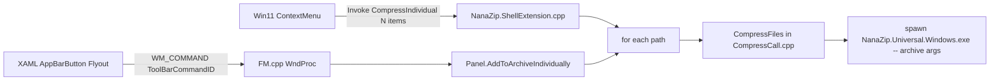
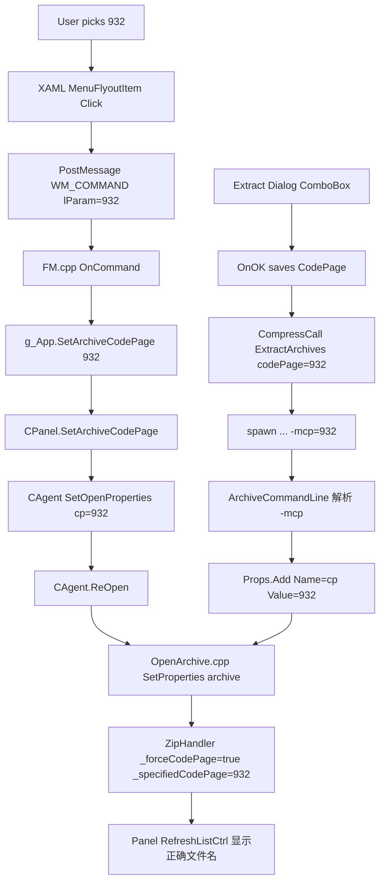

# NanaZip 双特性增强方案（详细实施方案）

> 全程严格遵守 `developmentrule.json`：不触碰任何 `Mile.*` 前缀文件 / 文件夹（包括 `NanaZip.Codecs/Mile.Helpers.Portable.Base.Unstaged.*` 与 vcxproj 中的 `Mile.Project.*` SDK import），UI 沿用既有 Win11 XAML / Win32 对话框规范，全部复用 NanaZipCore / 7-Zip 引擎接口（仅传参，不改算法），新增源文件会同步更新对应 `.vcxproj` 与 `.vcxproj.filters`。

## 1. 项目结构速览（已确认）

- `NanaZip.UI.Modern/` —— Shell Extension（Win11 右键菜单）+ FileManager（Win32+XAML 岛主界面 `NanaZip.Modern.FileManager.exe`）
- `NanaZip.Modern/` —— XAML 页面（工具栏 `MainWindowToolBarPage.xaml` 等）
- `NanaZip.Universal/` —— 命令行 GUI 后台 `NanaZip.Universal.Windows.exe`（实际执行压缩/解压、宿主 `CompressDialog`/`ExtractDialog`）
- `NanaZip.Core/` —— 7-Zip 引擎核心，包含 Zip handler 的代码页属性实现
- 解决方案：`NanaZip.slnx`，构建系统 MSBuild + Mile.Project SDK；新增 `.cpp/.h` 须同时挂到对应 `.vcxproj` + `.vcxproj.filters`

## 2. 复用的关键既有机制（无需重写）

- 右键菜单 ID：[`NContextMenuFlags`](NanaZip.UI.Modern/SevenZip/CPP/7zip/UI/Explorer/ContextMenuFlags.h) 中已有 `kCompress`、`kCompressTo7z`、`kCompressToZip` 等位图 flag；新功能按相同模式扩位
- Shell Extension 调度：[`NanaZip.ShellExtension.cpp`](NanaZip.UI.Modern/NanaZip.ShellExtension.cpp) 的 `ExplorerCommandRoot::Initialize` 注册子命令、`ExplorerCommandBase::Invoke` 派发 `CommandID`，最终调用 [`CompressFiles`](NanaZip.UI.Modern/SevenZip/CPP/7zip/UI/Common/CompressCall.cpp) 启动 `NanaZip.Universal.Windows.exe` 子进程
- 7-Zip CLI 已支持的两个开关，不需改引擎：
  - 压缩输出名 / 类型 / 是否弹对话框 / 是否追加扩展名（`-an -ai -t -ad -saa -sae`）
  - **`-mcp=<n>`**：把 `cp` 属性透传给 archive handler；Zip handler 已实现，见 [`ZipHandlerOut.cpp`](NanaZip.Core/SevenZip/CPP/7zip/Archive/Zip/ZipHandlerOut.cpp) 中：

```564:570:NanaZip.Core/SevenZip/CPP/7zip/Archive/Zip/ZipHandlerOut.cpp
    else if (name.IsEqualTo("cp"))
    {
      UInt32 cp = CP_OEMCP;
      RINOK(ParsePropToUInt32(L"", prop, cp))
      _forceCodePage = true;
      _specifiedCodePage = cp;
    }
```

  以及读 zip 时使用：

```389:395:NanaZip.Core/SevenZip/CPP/7zip/Archive/Zip/ZipHandler.cpp
    case kpidPath:
    {
      UString res;
      item.GetUnicodeString(res, item.Name, false, _forceCodePage, _specifiedCodePage);
```

- Agent / Panel 打开 archive 时把属性灌进去：[`Agent.cpp`](NanaZip.UI.Modern/SevenZip/CPP/7zip/UI/Agent/Agent.cpp) 当前 `options.props = NULL`，后续走 [`OpenArchive.cpp`](NanaZip.Core/SevenZip/CPP/7zip/UI/Common/OpenArchive.cpp) → `SetProperties(archive, *op.props)`，我们只需把 `CObjectVector<CProperty>` 挂上去即可
- XAML 工具栏 → Win32 FM 主窗：[`MainWindowToolBarPage.cpp`](NanaZip.Modern/MainWindowToolBarPage.cpp) 通过 `PostMessageW(..., WM_COMMAND, MAKEWPARAM(ToolBarCommandID::*, BN_CLICKED), 0)` 与 [`FM.cpp`](NanaZip.UI.Modern/SevenZip/CPP/7zip/UI/FileManager/FM.cpp) 的 `kMenuCmdID_Toolbar_*` 联动；扩位即可

## 3. 功能 1：多文件/文件夹分别压缩

按您选择的"全套三项"实现，与现有 `Compress` / `CompressTo7z` / `CompressToZip` 一一对齐。

### 3.1 新增的 Flag / CommandID / IDS（沿用既有 NanaZip 修改注释风格）

文件 [`NanaZip.UI.Modern/SevenZip/CPP/7zip/UI/Explorer/ContextMenuFlags.h`](NanaZip.UI.Modern/SevenZip/CPP/7zip/UI/Explorer/ContextMenuFlags.h) 新增三个位（避开已用 0..3、4..6、8..13、30..31）：

```cpp
const UInt32 kCompressIndividual         = 1 << 14;
const UInt32 kCompressTo7zIndividual     = 1 << 15;
const UInt32 kCompressToZipIndividual    = 1 << 16;
```

文件 [`NanaZip.UI.Modern/SevenZip/CPP/7zip/UI/Explorer/resource.h`](NanaZip.UI.Modern/SevenZip/CPP/7zip/UI/Explorer/resource.h) 新增 IDS（紧接 2331 之后）：

```cpp
#define IDS_CONTEXT_COMPRESS_INDIVIDUAL          2332
#define IDS_CONTEXT_COMPRESS_TO_INDIVIDUAL       2333
```

文件 [`NanaZip.UI.Modern/SevenZip/CPP/7zip/UI/Explorer/resource2.rc`](NanaZip.UI.Modern/SevenZip/CPP/7zip/UI/Explorer/resource2.rc) 增加英文默认串：

```text
IDS_CONTEXT_COMPRESS_INDIVIDUAL    "Compress each item to a separate archive..."
IDS_CONTEXT_COMPRESS_TO_INDIVIDUAL "Compress each item to a separate {0}"
```

> 简体中文及其它语言：NanaZip 主线翻译走 .lng 文件（社区维护），代码里只放英文 fallback 即可。后续翻译由本地化系统补齐。

### 3.2 Shell Extension 注册 + 派发

文件 [`NanaZip.UI.Modern/NanaZip.ShellExtension.cpp`](NanaZip.UI.Modern/NanaZip.ShellExtension.cpp)：

- `CommandID` 枚举追加 `CompressIndividual` / `CompressTo7zIndividual` / `CompressToZipIndividual`
- `ExplorerCommandRoot::Initialize` 中按 `ContextMenuFlags & kCompressIndividual` 等条件追加 3 个 `ExplorerCommandBase`，并仅在 `FilePaths.size() >= 2` 时显示（单文件时该功能没意义，避免界面噪音）
- `ExplorerCommandBase::Invoke` 在 switch 中新增分支：

```cpp
case CommandID::CompressIndividual:
case CommandID::CompressTo7zIndividual:
case CommandID::CompressToZipIndividual:
{
    bool ShowDialog = (this->m_CommandID == CommandID::CompressIndividual);
    bool Is7z       = (this->m_CommandID == CommandID::CompressTo7zIndividual);
    UString ArcType = ShowDialog ? UString() : UString(Is7z ? L"7z" : L"zip");

    for (size_t i = 0; i < FilePaths.size(); ++i)
    {
        UStringVector One;
        One.Add(FilePaths[i].c_str());

        NWindows::NFile::NFind::CFileInfo Fi;
        FString OneFolderPrefix;
        if (NWindows::NFile::NName::IsDevicePath(us2fs(One[0])))
            OneFolderPrefix = "C:\\";
        else
        {
            if (!Fi.Find(us2fs(One[0]))) continue;
            NWindows::NFile::NDir::GetOnlyDirPrefix(us2fs(One[0]), OneFolderPrefix);
        }
        UString OneArcName = CreateArchiveName(One, &Fi);

        CompressFiles(
            fs2us(OneFolderPrefix),
            ShowDialog ? OneArcName : (OneArcName + (Is7z ? L".7z" : L".zip")),
            ArcType, ShowDialog, One,
            /*email*/false, ShowDialog, /*waitFinish*/false);
    }
    break;
}
```

- 注意 `CompressFiles` 内部以"独立子进程"方式并行启动多个 `NanaZip.Universal.Windows.exe`；首版按"顺序串行启动子进程，不等待完成"（与现有快捷压缩行为一致）即可，避免 IO 风暴。后续若需要排队，可在第二阶段加节流。

### 3.3 Options 对话框（让用户能在 Options→7-Zip→Menu 里勾选）

文件 [`NanaZip.UI.Modern/SevenZip/CPP/7zip/UI/FileManager/MenuPage.cpp`](NanaZip.UI.Modern/SevenZip/CPP/7zip/UI/FileManager/MenuPage.cpp) 的 `kMenuItems[]` 数组追加：

```cpp
{ IDS_CONTEXT_COMPRESS_INDIVIDUAL,    kCompressIndividual },
{ IDS_CONTEXT_COMPRESS_TO_INDIVIDUAL, kCompressTo7zIndividual },
{ IDS_CONTEXT_COMPRESS_TO_INDIVIDUAL, kCompressToZipIndividual },
```

并在 `OnInit` 的 switch（处理 `IDS_CONTEXT_COMPRESS_TO`）后追加 `IDS_CONTEXT_COMPRESS_TO_INDIVIDUAL` 的 `.7z/.zip` 后缀格式化分支，沿用既有写法。同步在 [`ContextMenu.cpp`](NanaZip.UI.Modern/SevenZip/CPP/7zip/UI/Explorer/ContextMenu.cpp) 的 `g_Commands[]` 添加 `CMD_REC` 三行（用于经典 IContextMenu 路径）和 `CZipContextMenu::ECommandInternalID` 枚举扩位。

### 3.4 主界面（FileManager 自身）入口

- XAML：在 [`MainWindowToolBarPage.xaml`](NanaZip.Modern/MainWindowToolBarPage.xaml) 的 `AddButton` 上挂 `<AppBarButton.Flyout>`，flyout 里加 3 个 `MenuFlyoutItem`：常规添加 / 分别压缩到 .7z / 分别压缩到 .zip / 分别压缩...
- `MainWindowToolBarPage.cpp` 增加对应 click handler，发送 `WM_COMMAND` 携带新 `ToolBarCommandID::CompressIndividual{,7z,Zip}`
- [`FM.cpp`](NanaZip.UI.Modern/SevenZip/CPP/7zip/UI/FileManager/FM.cpp) 的 `OnCommand` 分发到 `g_App.AddToArchiveIndividually(mode)`
- [`Panel.cpp`](NanaZip.UI.Modern/SevenZip/CPP/7zip/UI/FileManager/Panel.cpp) 新增 `void CPanel::AddToArchiveIndividually(int mode)`，复用 `AddToArchive()` 中收集 `names` 的逻辑，再 `for` 循环按 mode 调 `CompressFiles` 一次/项；声明同步加进 [`Panel.h`](NanaZip.UI.Modern/SevenZip/CPP/7zip/UI/FileManager/Panel.h)

### 3.5 数据流图



## 4. 功能 2：代码页切换（解决文件名乱码）

按您选择的"工具栏下拉框（A）"且包含尽量丰富的小语种代码页。

### 4.1 代码页清单（统一在一个表里复用）

新增 `NanaZip.UI.Modern/SevenZip/CPP/7zip/UI/Common/CodePageList.h`（纯头表，无源文件改动）：

- `0` —— Auto / 自动（沿用现有 OEMCP/UTF-8 自动判别，不传 `cp`）
- `65001` UTF-8、`932` 日文 Shift-JIS、`936` 简体中文 GBK、`949` 韩文 EUC-KR/UHC、`950` 繁中 Big5
- `1252` 西欧、`1251` 西里尔、`1250` 中欧、`1253` 希腊、`1254` 土耳其、`1255` 希伯来、`1256` 阿拉伯、`1257` 波罗的海、`1258` 越南
- `874` 泰文、`866` DOS 西里尔、`437` OEM US、`850` OEM 多语种 Latin1、`852` Latin2（中欧 DOS）、`855` 西里尔 DOS
- `20932` JIS X 0208、`51932` EUC-JP、`51949` EUC-KR、`52936` HZ-GB、`54936` GB18030

> 表里每条记录 `{ UINT codepage; const wchar_t* displayName; }`，`displayName` 含友好名（如 "932 — 日文 (Shift-JIS)"），下拉框里直接显示。

### 4.2 解压对话框（NanaZip.Universal）

文件 [`NanaZip.Universal/SevenZip/CPP/7zip/UI/GUI/ExtractDialogRes.h`](NanaZip.Universal/SevenZip/CPP/7zip/UI/GUI/ExtractDialogRes.h) 新增：

```cpp
#define IDT_EXTRACT_CODE_PAGE   3440
#define IDC_EXTRACT_CODE_PAGE   3441
```

文件 [`NanaZip.Universal/SevenZip/CPP/7zip/UI/GUI/Extract.rc`](NanaZip.Universal/SevenZip/CPP/7zip/UI/GUI/Extract.rc) 在 `IDD_EXTRACT` / `IDD_EXTRACT_2` 模板里追加：

```text
LTEXT     "Code page:", IDT_EXTRACT_CODE_PAGE, 12, yyy, 60, 8
COMBOBOX  IDC_EXTRACT_CODE_PAGE, 80, yyy-2, 200, 120, CBS_DROPDOWNLIST | WS_TABSTOP | WS_VSCROLL
```

文件 [`ExtractDialog.h`](NanaZip.Universal/SevenZip/CPP/7zip/UI/GUI/ExtractDialog.h)：
- `CExtractDialog` 增 `NWindows::NControl::CComboBox _codePage;` 和 `UInt32 CodePage = 0;`（输入/输出）
- `kLangIDs[]` 加入 `IDT_EXTRACT_CODE_PAGE`

[`ExtractDialog.cpp`](NanaZip.Universal/SevenZip/CPP/7zip/UI/GUI/ExtractDialog.cpp)：
- `OnInit` 里 `_codePage.Attach(GetItem(IDC_EXTRACT_CODE_PAGE))`，遍历 `CodePageList.h` 把每个 `(cp,displayName)` 用 `combo.AddString_SetItemData(displayName, cp)` 加入；记忆值从 `_info`（新增 `CBoolPair`/`UInt32 CodePage`）读
- `OnOK` 把当前选项 `_codePage.GetItemData_of_CurSel()` 写回 `CodePage` 并保存到 `NExtract::CInfo::CodePage`（新增字段，需在 [`ZipRegistry.h/.cpp`](NanaZip.UI.Modern/SevenZip/CPP/7zip/UI/Common/ZipRegistry.cpp) 增加注册表读写键 `"ExtractCodePage"`）

### 4.3 把代码页传给底层引擎

#### 解压路径（CLI / 子进程）

[`CompressCall.h/.cpp`](NanaZip.UI.Modern/SevenZip/CPP/7zip/UI/Common/CompressCall.cpp) 的 `ExtractArchives` 增加可选参数（保持向后兼容，使用默认值）：

```cpp
void ExtractArchives(
    const UStringVector &arcPaths, const UString &outFolder,
    bool showDialog, bool elimDup, UInt32 writeZone,
    bool smartExtract = false, bool openFolder = false,
    UInt32 codePage = 0 /* 0 = auto / 不传 */);
```

实现里在 `params` 里追加：

```cpp
if (codePage != 0) {
    params += " -mcp=";
    params.Add_UInt32(codePage);
}
```

> 与 7-Zip CLI 解析一致：`-m<key>=<value>` 由 [`ArchiveCommandLine.cpp`](NanaZip.Universal/SevenZip/CPP/7zip/UI/Common/ArchiveCommandLine.cpp) 的 `{ "m", SWFRM_STRING_MULT(1) }` 接收，最终 `Properties.Add({ Name=L"cp", Value=L"<n>" })`，再经 `SetProperties` 喂给 archive handler。

`ExtractArchives` 的所有调用点（`NanaZip.ShellExtension.cpp`、`Panel.cpp` 的 `ExtractFromArchive` / `ExtractArchives`）按需透传 `codePage`，未指定则保持原行为。

#### 文件查看器（直接在进程内打开 archive）

主文件管理器打开 archive 走 [`Agent::Open`](NanaZip.UI.Modern/SevenZip/CPP/7zip/UI/Agent/Agent.cpp)，目前 `options.props = NULL`。改造方式：

1. `CAgent` 增加成员 `CObjectVector<CProperty> _openProps;` + `STDMETHOD(SetOpenProperties)(...)`（或直接暴露 `SetCodePage(UInt32 cp)` 简化调用）。
2. `Open` / `ReOpen` 中：

```cpp
COpenOptions options;
options.props = _openProps.IsEmpty() ? NULL : &_openProps;
```

3. `Panel` 在用户切换工具栏代码页下拉时，调用 `Agent->SetOpenProperties` 后触发既有的 `ReOpen` / `RefreshListCtrl()`（FM 已有 `OnReload` 路径），列表立刻按新编码刷新。

### 4.4 主界面工具栏 ComboBox（XAML）

文件 [`NanaZip.Modern/MainWindowToolBarPage.xaml`](NanaZip.Modern/MainWindowToolBarPage.xaml)：在 `BenchmarkButton` 之前、`AppBarSeparator` 之后插入：

```xml
<AppBarButton
  x:Name="CodePageButton"
  Width="48"
  AutomationProperties.Name="[Code page]"
  ToolTipService.ToolTip="[Code page]">
  <AppBarButton.Content>
    <TextBlock FontFamily="Segoe MDL2 Assets" Text="&#xF2B7;"/>
  </AppBarButton.Content>
  <AppBarButton.Flyout>
    <MenuFlyout x:Name="CodePageFlyout"/>
  </AppBarButton.Flyout>
</AppBarButton>
```

> 图标 `&#xF2B7;` 为 Segoe MDL2 Assets / Fluent 中的 `Translate`（双字符语言图形），与"翻译/语言"语义一致，符合 Win11 设计规范。

[`MainWindowToolBarPage.cpp/.h`](NanaZip.Modern/MainWindowToolBarPage.cpp)：
- `PageLoaded` 中遍历 `CodePageList`，向 `CodePageFlyout` `Items()` 追加 `MenuFlyoutItem`，每项 `Click` 回调把 codepage 通过 `PostMessageW(m_WindowHandle, WM_COMMAND, MAKEWPARAM(ToolBarCommandID::CodePage, BN_CLICKED), (LPARAM)cp)` 投递；同时高亮当前选中项（`Icon = FontIcon &#xE73E;` 勾号）
- 新增 `ToolBarCommandID::CodePage`
- 仅在 `_parentFolders` 非空（即正在浏览 archive 内部）时启用按钮——这点由 FM 在打开/关闭 archive 时 `PostMessage` 一个状态切换消息给 XAML 页（已有 `RefreshSponsorButtonContent` 类似机制可参考）

[`FM.cpp`](NanaZip.UI.Modern/SevenZip/CPP/7zip/UI/FileManager/FM.cpp) `OnCommand`：

```cpp
case kMenuCmdID_Toolbar_CodePage:
    g_App.SetArchiveCodePage((UInt32)lParam);
    break;
```

[`App.h/App.cpp`](NanaZip.UI.Modern/SevenZip/CPP/7zip/UI/FileManager/App.h) 加 `void SetArchiveCodePage(UInt32 cp) { GetFocusedPanel().SetArchiveCodePage(cp); }`；[`Panel.h/Panel.cpp`](NanaZip.UI.Modern/SevenZip/CPP/7zip/UI/FileManager/Panel.cpp) 实现把 cp 写入 Agent 后调 `OnReload` / `RefreshListCtrl`。

### 4.5 代码页 UI 流程图



## 5. MSBuild / vcxproj 同步更新

新增源文件需挂到对应 `.vcxproj` 与 `.vcxproj.filters` 的 `<ClCompile Include="..." />` / `<ClInclude Include="..." />`：

- 若按方案只新增 `CodePageList.h`（纯头）：挂到 [`NanaZip.UI.Modern/NanaZip.Modern.FileManager.vcxproj`](NanaZip.UI.Modern/NanaZip.Modern.FileManager.vcxproj)、[`NanaZip.Universal/NanaZip.Universal.Windows.vcxproj`](NanaZip.Universal/NanaZip.Universal.Windows.vcxproj)、[`NanaZip.Core/NanaZip.Core.vcxproj`](NanaZip.Core/NanaZip.Core.vcxproj)（如需）的 `<ClInclude>` 区段
- XAML 改动（`MainWindowToolBarPage.xaml/.cpp/.h`）：文件已在 [`NanaZip.Modern.vcxproj`](NanaZip.Modern/NanaZip.Modern.vcxproj) 中，只是改内容，无需追加条目；但若添加 `MenuFlyoutItem` 涉及新引用（如 `MenuFlyout`/`Microsoft.UI.Xaml.Controls`）需检查 idl/winmd 是否要更新（首版仅用 WinUI 2/UWP MenuFlyout，原生可用，无需新依赖）
- `.rc` 改动不需要修改 vcxproj
- 修改的现有 `.cpp/.h` 全部已在 vcxproj 中，不需要追加，仅需保证 NanaZip.UI.Classic 同步（`Classic` 与 `Modern` 的 `SevenZip/` 是各自独立副本，**两份都要改**才能在 Classic 编译目标里生效——这是历史遗留物，与 7-Zip ZS 上游一致）

> 不会触碰任何 `Mile.*` 文件 / 文件夹；vcxproj 中的 `<Import Sdk="Mile.Project.Configurations" .../>` 维持原样。

## 6. 测试清单（实现完成后跑）

- 资源管理器选 3 个文件 → 右键 NanaZip → "分别压缩为 .7z" → 当前目录得到三个 `*.7z`
- 资源管理器选 2 文件 + 1 文件夹 → 右键 → "分别压缩..."（弹对话框，选 zip+ultra）→ 三个独立 zip
- 主界面选中后点工具栏 Add 按钮的 flyout → 三种模式各跑一次
- 用一个含 Shift-JIS 文件名的旧 zip：双击进入 NanaZip 主界面，列表初始乱码 → 点工具栏翻译图标选 932 → 列表立即正确显示日文
- 同一旧 zip → 资源管理器右键解压 → 解压对话框代码页选 932 → 解压后 NTFS 目录里文件名正确
- 936 / 950 / 1256 / 1258 等代码页随机抽查
- Options → 7-Zip → Menu 中三个新条目可见、可勾选、勾选状态持久化（注册表 `Flags` 字段位被正确写入）
- 主线非 NanaZip 项目目录无任何改动；解决方案重新生成 x64 / ARM64 均成功

